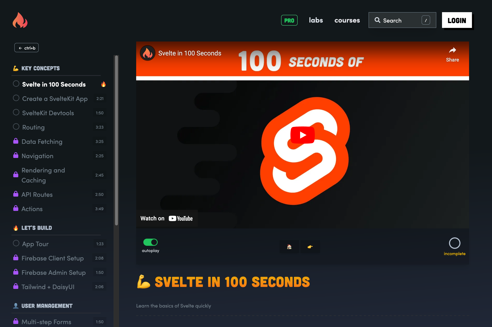
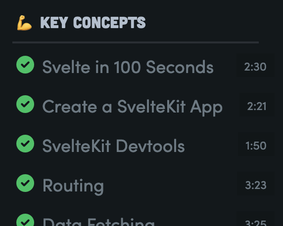
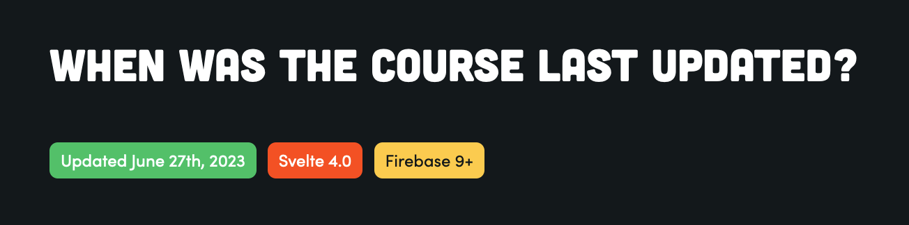

I recently worked through [the SvelteKit course](https://fireship.io/courses/sveltekit/) offered by Fireship.io through its paid-for membership site. This was my first time taking a course on Fireship, and I wanted to document some of the course interactions that I enjoyed and some areas that could be improved upon. Ideally, analysis like this can help you consider your own course designs and offerings.

## Overall Format

If you are unfamiliar with Jeff Delaney's Fireship, I recommend a quick scan of his [YouTube channel](https://www.youtube.com/@Fireship). You'll find sharp, terse, and meme-filled videos on the tech industry, including 100-second intros to various languages, frameworks and coverage of significant news drops.

The format of the SvelteKit course is 31 videos (2-3 minutes long each). The first 9 cover Svelte/SvelteKit concepts, and then the rest have you build a website similar to Linktree, where a user can sign up, create a bio and share a list of links on a public profile.

Gradual work towards one project worked well here, particularly due to the small scope of the project and the more advanced target audience. 

> 💡 To course authors, I would say that the tradeoff of a big student project usually comes down to the unfortunate constraint that the student has to work linearly and, if struggling, can not start fresh in later chapters. On the other hand, the student has a better opportunity to see more interconnected pieces of the code and better appreciate what this all looks like in production.

Under the headline "Is this Course Right for Me?" Jeff shares:

> This course is intermediate level 🟦 and expects some familiarity with JavaScript and web development. The content is fast-paced and similar to my style on YouTube, but far more in-depth and should be followed in a linear format. 

I agree with this positioning. There is not much hand-holding here, so beginners might need help. 

## 👍 The personality of the original YouTube channel carries over to the course.

The course materials are not nearly as meme'd up as the YouTube channel, but there is a strong sense that Jeff does not want to waste your time.

## 👍 I like how the course tracks my progress.

As you work through the course, you'll hit a button to mark the section as done. Seeing a long list of green checkmarks down the course navigation is satisfying.

## 👍 The concept sections end with quiz questions which help validate that I understand the material.

After the concept videos, and as you try to mark the section as complete, you get a fun little quiz. It's nothing too deep but a helpful confirmation that I learned what was expected of me. It also adds much of the fun personality this course sells.

## 👎 Notes section was pretty bare bones.

Under each video is a set of notes from the video. Here you'll see links and code samples for what you need to do you your local copy of the project to move forward.

Overall I found the notes and code snippets to be too simple. For example, sometimes you'd be adding code to a file, but I needed better context to understand where I needed to add the code in the file. Additionally, there were just some videos where the code was not in the notes, and I had to pause the video at an exact frame to see the code and copy it to my project.

> 💡 I think many course authors struggle between the ratio of video content and written content when building their courses. Jeff and Fireship obviously lean hard into the video side of things with the YouTube heritage, so I'm a little forgiving of the lack of deep notes, but in general, I would recommend more. Give the students some extra guidance and follow-up. 

> Aside: Repetition of concepts is key to successful courses. In my own workshop work, each unit was a mix of brief front-of-the-class concept introductions, with me speaking and slide visuals, then the students read through the book chapter, typing out each project addition. That repetition of **hearing it**, **reading it** and **typing it** was a principal design pattern for how we wanted to enable student success.

## 🤷‍♂️ The videos are fast. Too fast?

Matching the style of the YouTube channel, the topic videos are short and fast. Most with a runtime of 2-3 minutes. I watched the videos multiple times, once to get an overview of what we were doing and then a second or third time, pausing often as I typed out the working project to follow along.

I don't know if that is a problem, but it felt a little strange to me.

## 👍 Discord community was helpful.

An invite link to Discord is promoted at the bottom of each lesson. There are lots of people there and spaces to ask for help with the course. I would search or browse this a bit, and it helped me a bunch.

## 👍 Appreciate the detailed dates and version references.

I very much appreciate that precise dates and version metadata are listed in the course.

## 👎 & 👍 There were more typos and code mismatches between the videos and notes than expected.

I observed more typos and code discrepancies (video vs. notes) than I expected. Nothing earth-shattering, but I wonder if the course had a proper tech review before being made public.

On the positive side, the course notes themselves are on GitHub, and I got to submit [a few PRs](https://github.com/fireship-io/fireship.io/pulls?q=is%3Apr+author%3Azorn+is%3Aclosed) at the end of my course run to help fix them!

## 👎 I missed the project repo link early on. 

Writing this review, I was able to confirm that Jeff does share a [GitHub link](https://github.com/fireship-io/fkit-course) to the final project code early on, but I guess I missed it. 

During the course, I wondered what some pages should look like (or trying to figure out what I was supposed to do around authentication). I was annoyed I did not have the final project repo, but I eventually found it, maybe via Discord. I do not remember for sure.

> 💡 One idea/fix for this would be to have a dedicated section labeled resources in the course outline.

## 👎 Course assumes beginner-level expertise with Firebase, which may hinder some students.

Some parts of the course had you set up a Firebase project and related services. While I worked my way through, it was not something I was experienced with, so it felt very uneasy. I'd like to see more guidance in the videos and notes on how to do this, as I fear it might be more problematic for others.  

A recent thing I learned while watching the [Honeypot video on Jeff](https://www.youtube.com/watch?v=XRoSBWYMefY) was that Fireship started as a site dedicated to Firebase. There are lots of other Firebase-related videos on the site. It could be that Jeff assumes his audience is already comfortable with Firebase, and he might be right -- though additional notes or cross-linked video introductions to Firebase would be welcome for Firebase newbies who stumble into this course (like me). 

## 👎 My deployment never worked.

The end of the course has you use Firebase to host and deploy the Svelte app. Even in the video, Jeff explains that this is early experimental support by Firebase. When I tried it, the npm versions complained about a dependency conflict that I could never solve.

## 💡 Idea: Better course searching.

There is a search box on the Fireship site, but it is site-scoped and not course-scoped. I'd like to search within the course only, including the video transcripts.

## 💡 Idea: More direct GitHub "fix a typo" links.

While I appreciate and took advantage of fixing typos on GitHub, no UI is provided on the site to suggest this path (it is on other pages but not within the course content).

It would be cool if each page in the course had a link at the bottom that directs you to that specific file in the GitHub repo so people could easily offer typo fixes or note additions.

## 💡 Idea: More direct Discord discussion areas.

The Discord has a generic help section, and while questions can be tagged as Svelte, there is no way to have a 1:1 discussion about a section in the course. 

Allowing the students to ask questions right within the courseware might be helpful. Being able to see those other students' questions might answer my own.

Ultimately I feel alone on the course site and wonder if there are opportunities to link students together here somehow.

***

Hopefully, these observations inspired some internal considerations as you work on your own courses. If you have spotted some course interactions that should be shared and promoted to your fellow course authors, please let me know](/contact). Thanks.
