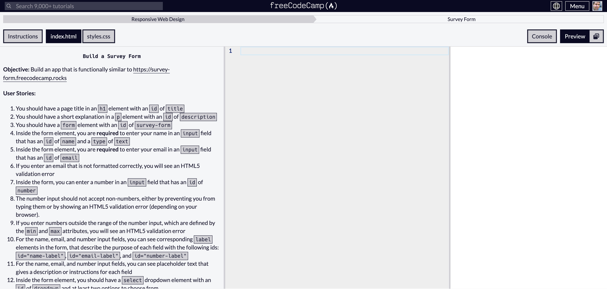

Tutorial Hell is that phase in a student's journey where they complete courses and online examples, but when it comes time for them to do something independently, they freeze. They'll sit there, starting at an empty file inside a freshly generated project template, and they don't know what to do. They've spent months consuming content, and it felt like they were learning, but now, in the moment of creation, they are frozen.

The hard truth I share with my students is that no matter how good the video, the lecture, or the book is, you will not learn how to program by consuming. You are not Neo, and this is not the Matrix. The only way you will learn is by doing.

From the book [Art & Fear][1]:

> [A] ceramics teacher announced on opening day that he was dividing the class into two groups. All those on the left side of the studio, he said, would be graded solely on the quantity of work they produced, all those on the right solely on its quality. His procedure was simple: on the final day of class he would bring in his bathroom scales and weigh the work of the "quantity" group: fifty pound of pots rated an "A", forty pounds a "B", and so on. Those being graded on "quality", however, needed to produce only one pot — albeit a perfect one — to get an "A". Well, came grading time and a curious fact emerged: the works of highest quality were all produced by the group being graded for quantity. It seems that while the "quantity" group was busily churning out piles of work – and learning from their mistakes — the "quality" group had sat theorizing about perfection, and in the end had little more to show for their efforts than grandiose theories and a pile of dead clay.

[1]: https://www.amazon.com/exec/obidos/ASIN/0961454733/

So, as course designers, what can we do to **help our students avoid this paralysis?** My suggestion is to ensure your course is NOT just about content consumption but instead sprinkled with various points of action. Specifically, things that can help a student verify their comprehension of the materials and spaces for them to stretch their creative muscles.

## Verify student comprehension via automated feedback loops.

Imagine you are a student reading a book or watching a video series about a new programming language. You sit there on the couch, finishing chapter 1, then 2, then 3. It feels like you are learning, but are you?

Now imagine an online course where you finish module 1, and before moving on to module 2, you are presented with a short quiz—nothing too crazy, but a little confirmation you understood the material. A nice, simple signal.

Perhaps later, an inline (or external) programming assignment is provided. In a project cloned from GitHub, you are told to run the tests to observe failure and then instructed to make them all pass. More confidence has been gained, and we are getting closer to a more realistic work environment.

Aside: Ideally, it can be helpful if this kind of code editor / test run were integrated into your course platform (particularly for those very fresh to programming), but this is not a hard requirement. You can get pretty far with external form tooling. Additionally, there is a point where you want the student to work in a realistic editing environment. You need them to experience the typos, build errors, and autocomplete menus like "real programmers" do.

## Provide empty canvas problems and opportunities for human review.

The website freeCodeCamp has some great examples of student feedback loops. They provide automated testing inside the main course articles that verify correctness immediately. However, special mention should be made for their Certification Projects.

After working through the smaller, hand-held, interactive course modules, freeCodeCamp gives the students a blank-page project where, on their own, they have to solve the stated problem. The platform continues to run automated tests to verify the solution, but the page starts empty. Working through an empty blank page is excellent practice for what these students will face in the real world. To help your students gain authentic confidence, you must allow them to fail, get messy, and learn from their mistakes. I think these kinds of "mini-bosses" (as they describe the design pattern internally) is an excellent approach.

When crafting your empty-page projects, I suggest primarily relying on the previously taught concepts, but sprinkling in some adjacent ideas is also helpful. 

For example, lets imagine you just taught people about using the [Elixir Enum module](https://hexdocs.pm/elixir/Enum.html) to `map/2` a list into something else. In your student problem, maybe nudge the student towards adjacent functions like `filter/2`. Perhaps you can describe the problem without directly linking to the specific new function docs or only provide the link in a hidden hint (if needed).

The goal here is twofold. One, you want the students to be able to use their creativity to fill in the blanks. Two, you want the students to get comfortable browsing the language documentation to find their answers. 

**Teaching a student how to find answers is arguably more critical than the raw facts of your course.**

If you offer your course alongside your personal teaching availability,  consider a workflow where the student submits these projects as homework for manual critique. Even with a working solution, encourage the student to attach questions about code that works, but it may be more clunky than it could be.

In a non-beginner space, you might even encourage students to share solutions with each other. It can be helpful for a single student to observe how others students solved the same problem and could even kickoff a productive discussion of style amongst the students.

***

Hopefully, this post helped you brainstorm some non-consumption ideas for your course. 

If you want to check more emotion on the topic of tutorial hell, you can [find lots of emotional discussions on Reddit][2] from other students.

[2]: https://www.reddit.com/r/learnprogramming/search/?q=tutorial%20hell

The style that freeCodeCamp uses is internally referred to as "mini-bosses" in a kind of game design mindset. For more background on their approach, check out this [podcast interview with freeCodeCamp founder Quincy Larson][3].

[3]: https://badass.dev/podcast/course-builders/preparing-learners-for-the-blank-canvas-with-quincy-larson

That's it for today. Thanks for your time, and I'll see you in the next one.
